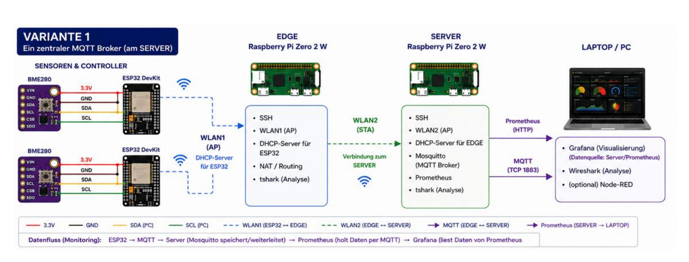
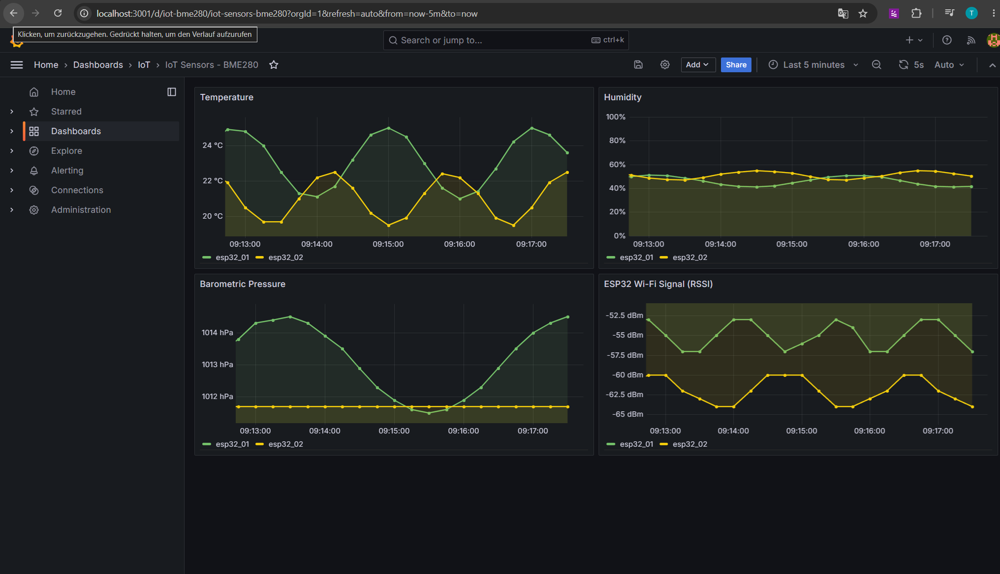

# IoT Edge Stack

> End-to-end IoT telemetry pipeline on Raspberry Pi: **ESP32 sensor nodes → Wi-Fi edge gateway (routing/NAT) → monitoring server (MQTT + Prometheus) → Grafana dashboards.** The server-side backend also ships as a one-command Docker stack.

[](https://github.com/tahsinm-dev/iot-edge-stack/actions/workflows/ci.yml)


A self-contained, reproducible IoT system built around two Raspberry Pi Zero 2 W
nodes. **ESP32 + BME280** sensors publish temperature, humidity and pressure over
MQTT. An **edge gateway** bridges an isolated sensor Wi-Fi into a backbone Wi-Fi
and routes the traffic to a **monitoring server**, where the data is stored in
Prometheus and visualised in Grafana.

📊 Short presentation: [`docs/slides.pdf`](docs/slides.pdf)

---

## Highlights

- **Wi-Fi networking on Linux** — Raspberry Pis acting as access point and upstream
  client (`hostapd`, `wpa_supplicant`, `dnsmasq`), with **IP forwarding and NAT**
  between an isolated sensor subnet and the backbone.
- **Edge gateway** — receives sensor data on one radio and forwards it upstream on a
  second radio (USB Wi-Fi adapter), keeping the sensor network segmented.
- **Observability** — custom MQTT→Prometheus exporter, Prometheus scraping and
  **alerting rules**, Grafana dashboards **provisioned as code**.
- **Infrastructure as code** — the full backend runs as a `docker compose` stack;
  the Raspberry Pis are provisioned with **Ansible**.
- **Embedded firmware** — ESP32 sketch (C++/Arduino) with the BME280 sensor,
  auto-reconnect, MQTT Last-Will and a Wi-Fi signal metric.
- **Security-aware** — authenticated MQTT broker with a **TLS** listener, non-root
  containers, no secrets in version control (see [`docs/security.md`](docs/security.md)).

## Architecture



**Data flow:** the ESP32 joins the edge access point and publishes
`sensor/<device>/bme280` JSON messages. The edge gateway NATs the traffic onto the
backbone, where Mosquitto receives it. The exporter turns the MQTT payloads into
Prometheus metrics, Prometheus scrapes and stores them, and Grafana visualises the
result.

### Network plan

| Segment      | Subnet             | Gateway / AP    | SSID            |
|--------------|--------------------|-----------------|-----------------|
| Sensor net   | `192.168.166.0/24` | EDGE `…166.1`   | `EDGE-IOT-XX`   |
| Backbone net | `192.168.176.0/24` | SERVER `…176.1` | `SERVER-IOT-XX` |

Server services: Mosquitto `:1883`, Prometheus `:9090`, MQTT exporter `:9101`.

## Results

Live Grafana dashboard — BME280 temperature, humidity, pressure and ESP32 Wi-Fi
signal for two sensor nodes, provisioned automatically from code:



## Tech stack

| Layer      | Technology                                                               |
|------------|--------------------------------------------------------------------------|
| Firmware   | ESP32, BME280, Arduino/C++, PubSubClient (MQTT)                          |
| Networking | Raspberry Pi OS, systemd, hostapd, wpa_supplicant, dnsmasq, iptables/NAT |
| Messaging  | Eclipse Mosquitto (MQTT)                                                  |
| Monitoring | Prometheus, custom Python exporter, Grafana                              |
| Automation | Docker / Docker Compose, Ansible, GitHub Actions                        |

## Run it

### Option A — Containerised backend (no hardware needed)

Reproduce the whole backend on any machine with Docker in about a minute.

> **Prerequisite:** Docker must be installed **and running**. On Windows/macOS, start
> **Docker Desktop** first and wait until it reports **“Engine running”** — otherwise
> `docker compose` aborts with a *“cannot connect to the Docker daemon”* error.

Clone the repository, then:

```bash
cd monitoring
cp .env.example .env
docker compose up -d --build
```

| Service    | URL                     | Login                 |
|------------|-------------------------|-----------------------|
| Grafana    | http://localhost:3000   | `admin` / `admin`     |
| Prometheus | http://localhost:9090   | —                     |
| MQTT       | `localhost:1883`        | `iot` / `changeme`    |

Publish a sample reading and watch it appear on the **IoT Sensors – BME280**
dashboard within ~15 seconds (credentials are the defaults from `.env.example`):

```bash
docker compose exec mosquitto mosquitto_pub -u iot -P changeme \
  -t sensor/esp32_01/bme280 -m '{"temp":23.5,"hum":45.2,"press":1013.2,"rssi":-57}'
```

Tear everything down with `docker compose down -v`. More detail — TLS, alert rules,
provisioning — is in [`monitoring/README.md`](monitoring/README.md).

### Option B — Full hardware deployment

Provision the two Raspberry Pis and flash the ESP32. The [Ansible playbooks](ansible/)
apply the [`edge/`](edge/) and [`server/`](server/) configuration in one command; the
firmware is in [`firmware/`](firmware/), and the commissioning log with the per-step
verification is in [`PROTOKOLL.md`](PROTOKOLL.md).

## Repository structure

```
.
├── firmware/        # ESP32 sketch (BME280 -> MQTT)
├── edge/            # EDGE Pi: access point + uplink + NAT configs
├── server/          # SERVER Pi: access point + MQTT/Prometheus configs
├── monitoring/      # containerised backend (docker compose, provisioning)
├── ansible/         # automated Raspberry Pi provisioning
├── docs/            # architecture, network plan, images
└── PROTOKOLL.md     # build & commissioning log
```

## Design decisions

The edge node runs an access point **and** an upstream client at the same time. The
Raspberry Pi's on-board Wi-Fi chip can do this only on a single shared channel and
proved unreliable for concurrent data traffic, so the design uses a **second (USB)
Wi-Fi adapter** on the edge — one radio per role. The full reasoning is documented
in [`docs/architecture.md`](docs/architecture.md).

## License

Released under the [MIT License](LICENSE).
